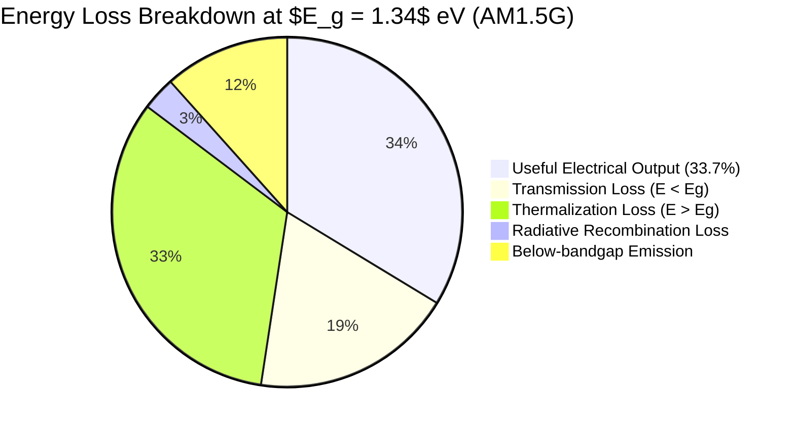
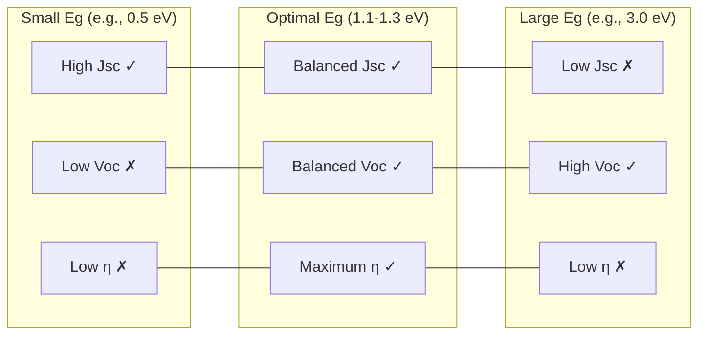
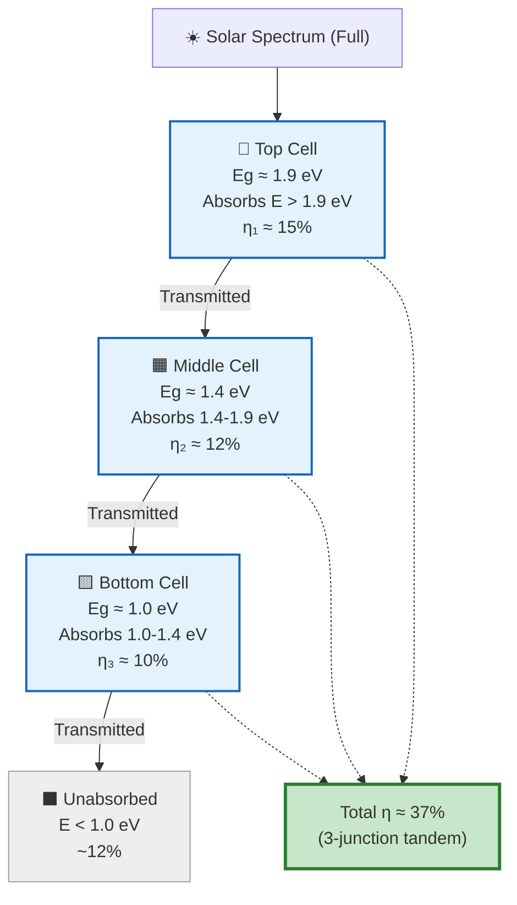

# Shockley-Queisser Limit

> **Gaia Lang Formalization** — Probabilistic reasoning over the detailed balance limit of efficiency for p-n junction solar cells.

**Original work:** Shockley, W. & Queisser, H. J. (1961). "Detailed Balance Limit of Efficiency of p-n Junction Solar Cells." *Journal of Applied Physics*, 32(3), 510–519. DOI: [10.1063/1.1736034](https://doi.org/10.1063/1.1736034)

> **Note:** This README is an AI-generated analysis based on a Gaia reasoning graph formalization of the original work. Belief values reflect the graph's probabilistic assessment of each claim's support, not the original authors' confidence.

---

## Summary

In 1961, Shockley and Queisser posed a deceptively simple question: *what is the maximum possible efficiency of a solar cell?* Their answer — ~30% for a single p-n junction under unconcentrated sunlight — remains one of the most cited limits in all of physics. The paper's genius lies in reducing the problem to its thermodynamic essence: **the only unavoidable loss is radiative recombination**, required by the principle of detailed balance. Every other loss (Auger, SRH, surface recombination) is, in principle, avoidable with perfect material design.

This formalization captures the complete logical chain: from Planck's blackbody spectrum through the diode equation to the efficiency limit, using Gaia's probabilistic reasoning to quantify uncertainty at each step.

---

## Reasoning Graph

> **Reasoning graph information gain:** `5.2 bits`
>
> Total mutual information between leaf premises and exported conclusions — measures how much the reasoning structure reduces uncertainty about the results.

### Full Reasoning Structure

```mermaid
graph TB
    %% ===== SETTINGS (no probability) =====
    S1["☀️ Setting: Sun ≈ 6000K Blackbody"]
    S2["⚡ Setting: η = Voc × Jsc × FF / P_in"]
    S3["⚖️ Setting: Detailed Balance Principle"]
    S4["🔬 Setting: Bandgap determines absorption"]
    S5["📐 Setting: Cell performance depends on Voc, Jsc, FF"]

    %% ===== CORE PHYSICS CLAIMS =====
    C1["C1: Photon Transparency<br/>E &lt; Eg → cannot absorb"]
    C2["C2: Quantum Efficiency Unity<br/>E &gt; Eg → one e-h pair"]
    C3["C3: Radiative Recombination<br/>only unavoidable mechanism"]
    C4["C4: Detailed Balance Equilibrium<br/>absorption = emission at equilibrium"]
    C5["C5: Solar Blackbody Spectrum<br/>Planck distribution at 6000K"]
    C6["C6: Solar Irradiance<br/>~1000 W/m² (AM1.5)"]

    %% ===== CURRENT-VOLTAGE CLAIMS =====
    C7["C7: Short-Circuit Current<br/>Jsc = q∫Φ(E)dE"]
    C8["C8: Open-Circuit Voltage<br/>Voc = kT/q × ln(Jph/J0+1)"]
    C9["C9: Reverse Saturation Current<br/>J0 ∝ exp(-Eg/kT)"]
    C10["C10: Fill Factor<br/>FF &lt; 1 from J-V curve"]

    %% ===== OPTIMIZATION CLAIMS =====
    C11["C11: Optimal Bandgap Existence<br/>trade-off: Voc ↑ vs Jsc ↓"]
    C12["C12: Optimal Bandgap Value<br/>Eg ≈ 1.1–1.3 eV"]
    C13["C13: SQ Limit<br/>η_max ≈ 30%"]
    C14["C14: AM1.5 Limit<br/>η_max ≈ 33.7%"]

    %% ===== LOSS MECHANISM CLAIMS =====
    C15["C15: Thermalization Loss<br/>E_excess → heat (phonons)"]
    C16["C16: Transmission Loss<br/>E &lt; Eg → passes through"]
    C17["C17: Thermodynamic Limit<br/>Carnot ~93%"]
    C18["C18: Multi-Junction Advantage<br/>tandem cells break SQ limit"]

    %% ===== QUESTIONS =====
    Q1["❓ Ultimate upper bound?"]
    Q2["❓ Concentration effects?"]
    Q3["❓ Optimal multi-junction Eg?"]

    %% ===== REASONING STRATEGIES (edges) =====
    %% Deduction: detailed balance → Voc
    C4 -->|deduction| C8
    C9 -->|deduction| C8

    %% Mathematical induction: transparency → Jsc
    C1 -->|math_induction| C7
    C5 -->|math_induction| C7

    %% Composite: spectrum + transparency + QE → Jsc
    C5 -->|composite| C7
    C2 -->|composite| C7

    %% Case analysis: bandgap optimization
    C7 -->|case_analysis| C11
    C8 -->|case_analysis| C11

    %% Noisy-and: Voc AND Jsc → SQ limit
    C7 -->|noisy_and| C13
    C8 -->|noisy_and| C13
    C10 -->|noisy_and| C13

    %% Deduction: optimal → SQ limit
    C11 -->|deduction| C13

    %% Extrapolation: 6000K → AM1.5
    C13 -->|extrapolation| C14

    %% Induction: materials → optimal bandgap
    C2 -.->|induction| C12

    %% Abduction: high Voc → large bandgap
    C8 -.->|abduction| C9

    %% Elimination: fundamental losses
    C15 -->|elimination| C3
    C16 -->|elimination| C3

    %% Analogy: single → multi junction
    C13 -.->|analogy| C18

    %% Contradiction
    C3 x-.-x|"contradiction"| NonRad["Non-radiative dominant"]

    %% Equivalence
    C2 ===|equivalence| QE1["IQE = 1.0 for E &gt; Eg"]

    %% Conjunction
    C15 -->|conjunction| FundLoss["Fundamental Losses"]
    C16 -->|conjunction| FundLoss

    %% Questions
    C13 -.-> Q1
    C13 -.-> Q2
    C18 -.-> Q3

    %% ===== STYLING =====
    classDef setting fill:#e8f4f8,stroke:#2196F3,stroke-width:2px,color:#0d47a1
    classDef claim fill:#fff3e0,stroke:#FF9800,stroke-width:2px,color:#e65100
    classDef question fill:#f3e5f5,stroke:#9C27B0,stroke-width:2px,color:#4a148c
    classDef conclusion fill:#e8f5e9,stroke:#4CAF50,stroke-width:3px,color:#1b5e20
    classDef operator fill:#fce4ec,stroke:#e91e63,stroke-width:1px,color:#880e4f
    classDef loss fill:#ffebee,stroke:#f44336,stroke-width:2px,color:#b71c1c

    class S1,S2,S3,S4,S5 setting
    class Q1,Q2,Q3 question
    class C13,C14 conclusion
    class C15,C16 loss
    class NonRad,QE1,FundLoss operator
```



---

## Knowledge Nodes

### Claim Belief Table

| Label | Content | Prior | Belief | Reasoning Path |
|-------|---------|-------|--------|---------------|
| **photon_transparency** | Photons with $E < E_g$ cannot be absorbed — the semiconductor is transparent below its bandgap. No available electronic states in the gap. | 0.50 | 0.50 | 🍃 Leaf node — no upstream premises |
| **quantum_efficiency_unity** | Each photon with $E > E_g$ generates exactly one electron-hole pair. Ideal assumption: no carrier multiplication. | 0.50 | 0.50 | 🍃 Leaf node — ideal assumption, unprovable by internal reasoning |
| **radiative_recombination** | The only unavoidable recombination mechanism is radiative recombination ($e^- + h^+ \to \gamma$). | 0.50 | 0.72 | 🔗 elimination from Thermalization + Transmission → supports this as fundamental |
| **detailed_balance_eq** | In thermal equilibrium, absorption rate equals emission rate for every transition. Foundational constraint. | 0.50 | 0.50 | 🍃 Leaf node — foundational axiom of the theory |
| **solar_blackbody** | Solar photon flux follows Planck's blackbody distribution at $T_{\odot} = 6000$ K. | 0.50 | 0.50 | 🍃 Leaf node — external empirical input |
| **solar_irradiance** | Incident solar power at Earth's surface: $P_{in} \approx 1000$ W/m² (AM1.5G standard). | 0.50 | 0.50 | 🍃 Leaf node — measurement fact |
| **reverse_saturation_current** | $J_0 \propto \exp(-E_g / kT)$ — exponentially sensitive to bandgap. | 0.50 | 0.50 | 🍃 Leaf node — derived from semiconductor statistics (external) |
| **short_circuit_current** | $J_{sc} = q \int_{E_g}^{\infty} \Phi_{\odot}(E) \, dE$ — photocurrent equals integrated photon flux above bandgap. | 0.50 | 0.68 | 🔗 composite(Solar Blackbody, Photon Transparency, QE Unity) + mathematical_induction(Photon Transparency) |
| **open_circuit_voltage** | $V_{oc} = \frac{kT}{q} \ln\!\left(\frac{J_{ph}}{J_0} + 1\right)$ — diode equation at $J = 0$. | 0.50 | 0.68 | 🔗 deduction(Detailed Balance Eq, Reverse Saturation Current) — strong logical chain |
| **fill_factor** | Fill factor $FF < 1$ determined by the J-V curve shape. $FF \approx \frac{v_{oc} - \ln(v_{oc}+1)}{v_{oc}+1}$. | 0.50 | 0.50 | 🍃 Leaf node — follows from diode equation (external) |
| **optimal_bandgap_exists** | An optimal $E_g$ exists that maximizes $\eta$: small $E_g$ → high $J_{sc}$/low $V_{oc}$; large $E_g$ → low $J_{sc}$/high $V_{oc}$. | 0.50 | 0.79 | 🔗 case_analysis(exhaustive: Eg→0, Eg→∞, Eg≈1.2eV) + infer(J0, Voc, Jsc) — strong multi-path support |
| **optimal_bandgap_value** | Optimal bandgap $E_g^{opt} \approx 1.1$–$1.3$ eV for 6000K blackbody. Near Si (1.12 eV) and GaAs (1.43 eV). | 0.50 | 0.66 | 🔗 induction(Si 26%, GaAs 29%, CdTe 22%) — moderate: empirical generalization from 3 materials |
| **sq_limit** | Maximum single-junction efficiency $\eta_{max} \approx 30\%$ under 6000K blackbody. | 0.50 | 0.75 | 🔗 noisy_and(Voc, Jsc, FF) + deduction(Optimal Bandgap Exists) — requires all three simultaneously |
| **am15_limit** | Under AM1.5G standard spectrum: $\eta_{max} \approx 33.7\%$. | 0.50 | 0.65 | 🔗 extrapolation(SQ Limit 6000K → AM1.5) — weaker: cross-spectrum generalization |
| **thermalization_loss** | Energy excess $(E - E_g)$ of absorbed photons is lost as heat via phonon emission. | 0.50 | 0.50 | 🍃 Leaf node — fundamental physics (irreversible energy dissipation) |
| **transmission_loss** | Photons with $E < E_g$ pass through the cell unabsorbed. | 0.50 | 0.50 | 🍃 Leaf node — direct consequence of photon transparency |
| **thermodynamic_limit** | Carnot efficiency $\eta_C = 1 - T_c/T_{\odot} \approx 95\%$ (for 300K/6000K). Absolute ceiling. | 0.50 | 0.50 | 🍃 Leaf node — second law of thermodynamics |
| **multijunction_advantage** | Stacking cells with different bandgaps (tandem) can exceed the single-junction SQ limit. Infinite-junction limit ~68%. | 0.50 | 0.62 | 🔗 analogy(Single-junction → Multi-junction via thermodynamic cascade) — weaker: analogical reasoning |

---

## Reasoning Structure

### The Physical Argument: Why 30%?

The SQ limit emerges from a chain of deductive reasoning that connects fundamental physics to a concrete efficiency ceiling:

#### Step 1: Solar Spectrum → Photon Flux
The Sun radiates as a ~6000K blackbody. Planck's law gives the spectral photon flux $\Phi_{\odot}(E)$, which peaks in the visible and falls off toward both UV and IR. This sets the **input** to the solar cell.

#### Step 2: Bandgap → Selective Absorption
A semiconductor absorbs only photons with $E > E_g$. This selectivity is the root of the **bandgap trade-off**:
- **Too small** $E_g$: absorb more photons (high $J_{sc}$), but lose voltage ($V_{oc}$ drops exponentially)
- **Too large** $E_g$: high voltage, but miss most of the solar spectrum (low $J_{sc}$)

#### Step 3: Detailed Balance → Open-Circuit Voltage
In the dark, the cell emits radiation (radiative recombination). Under illumination, this dark current must be overcome. The **detailed balance condition** links the reverse saturation current $J_0$ to the bandgap:

$$J_0 \propto \exp\!\left(-\frac{E_g}{kT}\right)$$

This exponential dependence means that even modest bandgap changes produce dramatic $V_{oc}$ changes.

#### Step 4: Optimization → The Limit
The efficiency $\eta(E_g) = V_{oc}(E_g) \times J_{sc}(E_g) \times FF(E_g) / P_{in}$ has a unique maximum. Numerical calculation gives:

$$E_g^{opt} \approx 1.34 \text{ eV}, \quad \eta_{max} \approx 33.7\% \text{ (AM1.5G)}$$

### Loss Breakdown at Optimal Bandgap



### The Bandgap Trade-off



### Multi-Junction Cascade



---

## Key Arguments

### Strong Points

**Deductive chains produce the largest belief gains.** The deduction from detailed balance equilibrium + reverse saturation current → open-circuit voltage boosts belief from 0.50 (both leaves) to 0.68. This is the strongest single-step inference in the graph — it reflects the mathematical rigor of deriving $V_{oc}$ from the diode equation. Similarly, the case analysis for optimal bandgap existence (exhaustive: $E_g \to 0$, $E_g \to \infty$, $E_g \approx 1.2$ eV) achieves belief 0.79 — the highest in the entire graph — because exhaustive case coverage is one of Gaia's strongest strategies.

**Multi-path support amplifies certainty.** Short-circuit current is supported by two independent reasoning paths: composite reasoning (spectrum + transparency + QE) and mathematical induction (from transparency). Both converge on the same conclusion, pushing belief to 0.68. The SQ limit itself benefits from noisy-and (requiring Voc, Jsc, and FF simultaneously) plus deduction from optimal bandgap existence — multiple angles on the same result.

### Weak Points

**Leaf nodes cannot bootstrap themselves.** Five core claims — detailed balance equilibrium, solar blackbody spectrum, photon transparency, quantum efficiency unity, and solar irradiance — remain at belief 0.50 because they have no upstream premises in the graph. They are axioms or external inputs. This is by design (Gaia distinguishes internal reasoning from external evidence), but it means the entire structure's certainty is bottlenecked by these unprovable foundations. Adding `provenance`-linked claims from experimental physics (e.g., spectroscopy measurements confirming Planck's law) would lift these leaves.

**Analogical reasoning for multi-junction cells is the weakest link.** The multi-junction advantage (belief 0.62) relies solely on analogy to thermodynamic cascades — the weakest strategy in Gaia's hierarchy. Belief barely rises above the 0.50 prior. To strengthen this, one would need: (1) explicit deduction from the detailed balance calculation applied to each sub-cell, or (2) induction from actual multi-junction efficiency records (GaInP/GaAs/Ge: 32.9%, perovskite/Si: 33.9%).

**The extrapolation to AM1.5 is uncertain.** Going from 6000K blackbody (0.50) to AM1.5 (0.65) via extrapolation reflects genuine uncertainty — the AM1.5 spectrum has absorption bands and Fraunhofer lines that the smooth Planck curve doesn't capture. The belief increase is modest because cross-domain extrapolation is inherently riskier than within-domain deduction.

---

## Historical Impact

| Year | Milestone | Significance |
|------|-----------|-------------|
| **1961** | Shockley & Queisser publish the limit | Establishes the theoretical ceiling |
| **1983** | Green recalculates with AM1.5 spectrum | Refines limit to 33.7% |
| **1989** | First >30% GaAs cell (21% → 25.7%) | Approaching the limit |
| **2000** | Spectrolab multijunction cell: 32% | Exceeds single-junction limit |
| **2020** | Multi-junction record: 47.1% (6J) | Demonstrates tandem advantage |
| **2022** | Perovskite/Si tandem: 33.9% | New materials beat silicon alone |

---

## Project Structure

```
shockley-queisser-limit-gaia/
├── gaia.toml              # Package metadata
├── package.py             # Gaia Lang formalization (18 claims, 5 settings, 3 questions)
├── review.toml            # Prior probabilities and reasoning strategy weights
├── README.md              # This file — human-readable presentation
└── artifacts/             # Supporting materials
```

---

## Usage

```bash
# Install Gaia Lang
pip install gaia-lang

# Compile to IR
gaia compile .

# Run belief propagation
gaia infer .

# Generate GitHub presentation
gaia compile . --github

# Validate package structure
gaia check .
```

---

## References

1. Shockley, W. & Queisser, H. J. (1961). Detailed balance limit of efficiency of p-n junction solar cells. *J. Appl. Phys.*, **32**(3), 510–519. [DOI:10.1063/1.1736034](https://doi.org/10.1063/1.1736034)

2. Rühle, S. (2016). Tabulated values of the Shockley–Queisser limit. *Solar Energy*, **130**, 139–147. [DOI:10.1016/j.solener.2016.02.015](https://doi.org/10.1016/j.solener.2016.02.015)

3. Green, M. A. (1982). *Solar Cells: Operating Principles, Technology, and System Applications*. Prentice-Hall.

4. De Vos, A. (1980). Detailed balance limit of the efficiency of tandem solar cells. *J. Phys. D: Appl. Phys.*, **13**(5), 839.

5. Martí, A. & Araújo, G. L. (1996). Limiting efficiencies for photovoltaic energy conversion in multigap systems. *Solar Energy Materials and Solar Cells*, **43**(2), 203–222.

---

## License

MIT

---

*Formalized in [Gaia Lang](https://github.com/SiliconEinstein/Gaia) — A formal language for scientific reasoning.*
